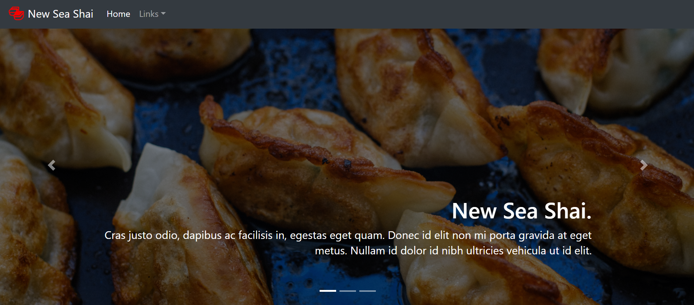

# seaShai

Over the summer, my sister worked at a Korean/Japanese restaurant. I decided to make them a website since theirs was outdated and relatively expensive. This site is hosted using Github Pages and was made using HTML, CSS, and Python.

